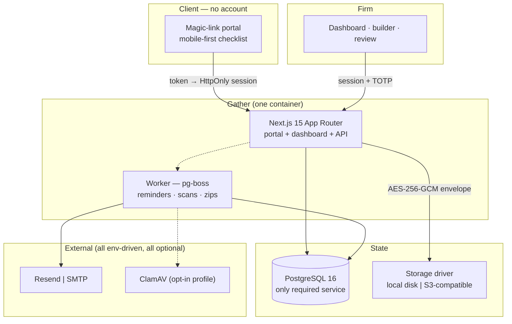

# Gather — Build Plan

**Status:** Phase 0 output. Awaiting operator approval.
**Research date:** 2026-07-28. Every price, endpoint and quota below was read from the live
source on that date; each is linked. Re-verify anything older than a quarter before quoting it
in marketing copy.

---

## 1. Vision

**Gather is the open-source end of client chasing.** A firm builds a request, the client gets a
link — no account, no password, no app — and automated reminders do the nagging until every item
is in. The firm approves or rejects **item by item**, so "done" means the firm says it's done, not
the client assuming it is.

Free and self-hosted is the whole product, not a demo. Paid cloud is hosting and convenience.

### Target user

| | |
|---|---|
| **Primary** | Solo-to-15-seat accounting, bookkeeping and tax firms in the US/UK/AU |
| **Secondary** | Small law firms, mortgage brokers/loan officers, fractional CFOs, agencies |
| **Buyer = user** | The owner/partner who is personally sending the follow-ups |
| **Trigger** | Tax season, month-end close, new-client onboarding, loan file assembly |
| **Disqualifier** | Firms wanting full practice management (billing, time tracking, tax prep) — that's TaxDome/Canopy/Karbon. Gather does one job. |

### Positioning

> Content Snare, minus the per-request meter, minus the vendor holding your clients' tax
> documents.

Gather is a **single-purpose tool**, not a suite. It never becomes a CRM. This is a feature: the
Reddit evidence below shows suites lose on client-side simplicity, and simplicity is the entire
job here.

---

## 2. Competitor teardown

### 2.1 Content Snare — the product to beat

Read live from [contentsnare.com/pricing](https://contentsnare.com/pricing/) on 2026-07-28:

| Plan | Annual (per mo) | Monthly | Active requests | Users | Storage | SMS/mo |
|---|---|---|---|---|---|---|
| Basic | $35 | $42 | 20 | 2 | 20 GB | 40 |
| Plus | $71 | $85 | 50 | 5 | 50 GB | 100 |
| Pro | $119 | $143 | 100 | 10 | 100 GB | 200 |
| Custom | $215+ | $258+ | 200+ | 20+ | 200 GB+ | 400+ |

14-day trial, no card. Custom branding is gated to Plus and above. Approvals are in all plans.

> ⚠️ **Correction to the brief.** The brief says "$29–215/mo". The $29 entry price is stale —
> Basic is **$35/mo annual, $42/mo month-to-month** today. Site copy must use the current numbers
> or we look sloppy to the exact audience we're courting.

**The wedge is the pricing axis, not the feature list.** Content Snare meters *active requests*.
A tax firm's business is seasonal by definition: a 300-client practice that sends organizers in
January is instantly in Custom territory (**$215+/mo, $2,580+/yr**) for three months of the year,
then sits idle. You are billed for the shape of your profession.

Gather self-hosted has **no request cap, no seat cap, no storage cap** — only the disk you already
pay for. That is the entire pitch, and it is not a feature Content Snare can match without
abandoning its revenue model.

**What they get right** (copy it, do not "improve" it):
[contentsnare.com](https://contentsnare.com/) ·
[client-portal-software](https://contentsnare.com/client-portal-software/)
- No client login: *"Clients access their portal through a secure link with no login, no password, and no app to install."*
- Item-level approve/reject with a comment; client resubmits only the rejected item.
- Automated reminders that stop on completion.
- Autosave — *"everything auto-saves so if they close the browser, they pick up right where they left off when the next reminder brings them back."*
- Reusable templates at section and request level.
- Their own headline claim: **"71% reduction in time spent chasing clients"**, 9,900+ users across 103 countries.

**Where they're vulnerable:** per-request pricing; a US firm's tax documents sit on a third-party
SaaS (a real objection under IRS Pub 4557 diligence); branding paywalled at Plus; no self-host at
any price.

### 2.2 FileInvite — the enterprise end

[fileinvite.com/plans-pricing](https://www.fileinvite.com/plans-pricing) (read 2026-07-28):
**Standard USD $9,900/year** for lenders doing up to 100 commercial loans/yr; Enterprise custom;
annual billing only; setup fees vary by implementation.

They're strong: PDF form-fill + multi-signing, persistent borrower portal, one-click
approve/reject, OneDrive/Drive/Box sync, SOC 2 Type II, MFA, virus detection, audit trails.
They're also **~$825/month minimum and sales-gated**. A two-person bookkeeping practice is not the
customer. Gather takes the bottom of this market — the people who'd never survive a FileInvite
procurement call.

Note they use a **persistent portal** (borrower logs in). We deliberately don't. See 2.5.

### 2.3 TaxDome / Canopy / Karbon — the suites

| Product | Price (read live) | Portal/chasing situation |
|---|---|---|
| **Canopy** — [pricing](https://www.getcanopy.com/pricing) | Standard **$74**/user/mo, Plus **$109**, Premium **$149** (annual). Add-ons: Tax Workflow Automation from **$34/client/yr**, Close Automation **$10**/connected client/mo, KBA **$1.25**/credit. No free tier. | Client portal is bundled in Standard, but you're buying a whole practice-management suite to get it. |
| **Karbon** — [pricing](https://karbonhq.com/pricing/) | Team **$59**/user/mo annual ($79 monthly); Business **$89** ($99 monthly); Enterprise custom. | **Automatic client reminders are Business-tier only.** The one feature that solves this pain costs $89/user/mo. |
| **TaxDome** | ⚠️ **Unverified.** [taxdome.com/pricing](https://taxdome.com/pricing/) returned **HTTP 403** to our fetch. Aggregators report ~$800–$1,200/user/yr (Essentials/Pro/Business). | Practitioners rate the organizer + auto-reminder loop very highly (quotes below). |

> 🚩 **Open item for the operator:** do not put a TaxDome price in site copy until someone loads
> that page in a browser and confirms it. Quoting an aggregator number to an audience of TaxDome
> customers is exactly how a launch loses credibility.

**The structural argument against all three:** they are per-seat, per-year, all-or-nothing
platform migrations. Gather is a $0, one-`docker compose up`, single-job tool that a firm can
adopt on a Tuesday without leaving its existing stack.

### 2.4 What practitioners actually say

Reddit's search API blocks our crawler; these were pulled from the
[pullpush.io](https://api.pullpush.io) archive and are linked to the live threads.

**No-login is the requirement, not a nice-to-have** —
r/Bookkeeping, [*"Following Up with Clients Who Don't Like Tech"*](https://redd.it/1ka0d1u).
OP is explicit about clients who:

> "…don't want to have to create accounts and log into portals, and prefer to just reply to an email"

and a commenter (u/boghy8823) describes our product's spec back to us as an unmet need:

> "I've been struggling with this exact problem! Most of my clients prefer email over portals. Are
> you finding that you spend a lot of time sorting through emails to figure out what's still
> outstanding? And do you have a system for tracking when you've asked for something multiple
> times?"

**Chasing is unpaid labour that firms have given up on billing** —
r/taxpros, [*"Dealing with missing client documents in spite of organizers"*](https://redd.it/147xrl6):

> u/mmgnyc: "in general this is a big part of our service chasing documents/holding hands."
>
> u/SeattleCPA: "Lots of our 1040 clients come to us not for tax preparation or tax planning. But
> because they lack the organizational skills to assemble the documents needed for their return…
> But this is a really hard 'service' to bill for."

**The audit trail is a defence document** —
r/taxpros, [*"Am I going crazy here??"*](https://redd.it/16znfop) — a client blames the preparer
for a late, expensive return:

> "I remind them that I have reached [out] 6x between February and April, and was not presented
> with tax information until April 12th."

→ Gather's hash-chained audit log exports exactly this, per item, with timestamps. That's a
feature no competitor markets and every practitioner in that thread wished they had.

**"Complete" must be firm-defined** —
r/taxpros, [*"How to deal with angry clients on turnaround times"*](https://redd.it/1kp4vj1).
OP: *"the constant pain of asking for 15 m[ore documents]"*, and:

> u/Buffalo-Trace: "Did you set the expectation when you took them on that your goal turnaround
> time is 2 weeks after you receive 'all' their documents? Not when they think they have given you
> everything"

→ This is the argument for per-item approve/reject as the core mechanic.

**Client-side friction burns real staff hours** —
r/taxpros, [*"SafeSend Returns & Organizers"*](https://redd.it/y8n3xn):

> u/ExcelNT_Acct: "My clients really struggle with it. We have an admin staff who basically is just
> on the phone with clients all day trying to figure it out." …one client "got locked out because
> he couldn't remember the color of a car he leased in 2004!"
>
> u/Confident_Surround73: "People trying to do everything on their smartphone is the only issue.
> When you download a copy of a return it is a .zip file which phones can't do anything with"
>
> u/TT5150: "the pricing is excessive. It's still a tool we will end up walking clients through."

→ Three hard design constraints: (1) **no KBA/identity quizzes** on the collection path;
(2) **mobile-first**, never hand a phone a zip; (3) if a client needs a phone call to use it, we failed.

**The feature set is proven — people already pay for it** —
r/taxpros, [*"Is taxdome worth it?"*](https://redd.it/w3mvz4):

> u/Tjraider35: "in 3 minute[s], they'll have a file open, an engagement letter sent to them, an
> organizer and automatic email reminders until I receive everything."

→ That loop is what we're making free. Demand is established; we're changing the price and the
ownership, not inventing a category.

And from Content Snare's own Show HN, [news.ycombinator.com/item?id=17422152](https://news.ycombinator.com/item?id=17422152):

> u/andyakb: "most client will drag their feet to no end on delivering the content. This is because
> they have 1,000 other things to do"

> **Sourcing note.** Vendor blogs circulate a "340 hours per firm per busy season" figure
> (e.g. [mentally.ai](https://mentally.ai/the-tax-season-time-bomb-why-your-firm-loses-340-hours-every-january-and-the-ai-solution-nobodys-talking-about/)).
> It traces to an unnamed panel remark, not a study. **Do not use it in site copy.** The brief's
> "100+ chase emails a day" is likewise unverified — treat as operator-supplied colour, not a stat.
> We have plenty of first-person practitioner quotes; use those instead. Content Snare's "71%"
> is quotable *as their claim*, attributed.

### 2.5 Open-source landscape

GitHub search (`gh search repos`) for *"document collection portal"*, *"client document request"*,
*"file request portal clients"* returns **only 0-star hobby repos** (`Gitbizzyboy/DocDrop`,
`zaanix-studio/docucollect`, `gutzzyu/documentRequest`). There is no maintained open-source
Content Snare. That is the opportunity.

Adjacent projects — none of which do structured, per-item, reminder-driven inbound collection:

| Project | Stars | What it actually is | Why it isn't Gather |
|---|---|---|---|
| [Cloudreve](https://github.com/cloudreve/cloudreve) | 28.4k | Self-hosted file manager | A drive, not a request |
| [ownCloud](https://github.com/owncloud/core) | 8.8k | File sync/share | Ditto |
| [Pingvin Share](https://github.com/stonith404/pingvin-share) | 4.7k | File transfer links | Outbound, one-shot |
| [Palmr](https://github.com/kyantech/Palmr) | 2.4k | File sharing | Outbound |
| Papermark | — | DocSend alternative | Outbound sharing + analytics |
| Nextcloud **File Drop** | — | Anonymous upload folder | Closest free option — and it's a dumb bucket: no checklist, no per-item status, no reminders, no approve/reject, no audit trail |

**Build on, don't rebuild:** [DocuSeal](https://github.com/docusealco/docuseal) (AGPLv3 +
Section 7(b) terms) for cloud-tier e-signature — self-hostable, `docuseal/docuseal` image, API and
webhooks in the OSS edition (white-label/SSO/embedding are Pro). Credit in README per §7.

---

## 3. Differentiation — why this wins as open source

1. **The pricing axis is the product.** Competitors meter the thing that spikes seasonally.
   Self-hosted Gather has no meter. For a 300-client January, that's $0 vs $215+/mo.
2. **Custody.** Tax documents never leave the firm's server. Under the FTC Safeguards Rule a firm
   is answerable for its service providers (§6). "It's on our box" is the shortest possible answer.
3. **The audit trail as evidence.** Hash-chained, exportable proof of every request, reminder and
   submission — the r/taxpros "I reached out 6x" problem, solved as a document you can hand to a
   client or an insurer. Nobody markets this.
4. **No account, ever.** Reddit says client-side friction is where portals die. Content Snare
   already proved no-login works; the suites still make clients log in.
5. **Single job, done completely.** No CRM, no time tracking, no upsell path into a suite.
6. **AGPL keeps it honest.** A competitor can't fork Gather into a closed hosted product without
   contributing back — while any firm self-hosting is entirely unaffected.

**Honest weaknesses:** no tax-software integration (Lacerte/Drake/UltraTax) in v1; no e-signature
in the free tier; self-hosting demands a person who can run Docker and configure DNS for email —
which is precisely why the cloud tier exists.

---

## 4. Architecture



**One hard rule: PostgreSQL is the only service Gather requires.** No Redis, no Elasticsearch, no
message broker. `pg-boss` gives us cron, delayed jobs, exponential-backoff retries and dedup keys
on Postgres alone ([MIT, Node ≥22.12, PG ≥13](https://github.com/timgit/pg-boss)). Every dependency
we don't have is a self-hoster we don't lose.

### 4.1 Stack, and why

| Layer | Choice | Reason |
|---|---|---|
| Language | **TypeScript** end to end | Protocol §7 allows TS or Python. One language for the portal, dashboard, API and worker means one build, one test runner, one Docker image. The client portal is the product's riskiest surface (mobile, autosave, drag-drop) and demands a first-class front end. |
| Framework | **Next.js 15** (App Router) | Portal + dashboard + API in one deployable. Server Components keep the client bundle small on bad phone connections. |
| DB | **PostgreSQL 16** | JSONB for item configs/responses, strong constraints for the state machine, and it doubles as the job queue. |
| ORM | **Drizzle** | No engine binary, plain SQL migrations — matters for `docker compose up` reliability and for auditability of a security-sensitive schema. |
| Queue | **pg-boss** | See above. |
| Auth (firm) | **Better Auth** ([MIT, 29.4k★](https://github.com/better-auth/better-auth)) + [`twoFactor()` TOTP plugin](https://www.better-auth.com/docs/plugins/2fa) | Self-hostable, Drizzle schema generation, and TOTP satisfies the MFA requirement in 16 CFR 314.4(c)(5). |
| Auth (client) | **Custom magic-link** | Deliberately not an identity system. Opaque token → short-lived scoped session. No account, ever. |
| Email | **Resend** or **SMTP** | Both real drivers behind one interface. |
| Storage | **local disk** (default) or **S3-compatible** | See 4.2. |
| AV | **ClamAV** container, opt-in | See 4.3. |
| Site | **Astro** | Protocol §6. Static output, deploy anywhere. |
| Tests | **Vitest** + **Playwright** | Playwright is non-negotiable: the portal must be proven on a mobile viewport. |

### 4.2 Storage — and a correction to the brief

> 🚩 **The brief specifies "MinIO for self-host default". Research says don't.**
>
> The [minio/minio](https://github.com/minio/minio) repository was **archived on 2026-04-25** and is
> read-only. The README now states the community edition is *"distributed as source code only. We
> will no longer provide pre-compiled binary releases for the community version."* Management
> features and the admin console were
> [stripped from the community edition in mid-2025](https://blocksandfiles.com/2025/06/19/minio-removes-management-features-from-basic-community-edition-object-storage-code/)
> and moved to the commercial AIStor product. Shipping an archived, binary-less dependency as the
> default in a 5-minute quickstart would be a bad call.

**Decision — a driver interface with two implementations:**

- **`STORAGE_DRIVER=local` (default).** Plain filesystem. Zero extra services, genuinely 5-minute
  install, and it's what a solo firm on one VPS actually wants.
- **`STORAGE_DRIVER=s3`.** Any S3-compatible endpoint — AWS S3, Cloudflare R2, Backblaze B2,
  Wasabi, SeaweedFS, an existing MinIO, or **[Garage](https://garagehq.deuxfleurs.fr/)**, which is
  what our optional compose profile ships. Garage verified 2026-07-28: **AGPL-3.0**
  ([LICENSE](https://git.deuxfleurs.fr/Deuxfleurs/garage/src/branch/main/LICENSE)),
  image `dxflrs/garage:v2.3.0`, and per its
  [S3 compatibility matrix](https://garagehq.deuxfleurs.fr/documentation/reference-manual/s3-compatibility/):
  presigned URLs ✅, full multipart ✅, Put/Get/Delete/ListObjectsV2 ✅. No bucket policies or ACLs —
  irrelevant to us, since buckets are never public and access is per-key.
  [SeaweedFS](https://github.com/seaweedfs/seaweedfs) (Apache-2.0, 33.8k★) documented as the
  scale-out alternative.

**Encryption trade-off, decided explicitly.** Files are encrypted at rest with **AES-256-GCM
envelope encryption** (per-file DEK wrapped by a master key from env/KMS; IV+tag stored alongside).
That means uploads **stream through the app** rather than going browser-direct via presigned PUT —
we cannot encrypt bytes we never see. Cost: app bandwidth. Justification: these are tax documents,
typically well under 25 MB, and 16 CFR 314.4(c)(3) requires encryption at rest **regardless of the
storage backend**. Direct-to-S3 presigned upload stays available behind
`STORAGE_ENCRYPTION=off` for anyone who'd rather have the throughput and relies on
bucket-level encryption. This trade-off gets documented in the README, not buried.

### 4.3 Virus scanning — opt-in, and here's why

[Official ClamAV docs](https://docs.clamav.net/manual/Installing/Docker.html) (read 2026-07-28):
image `clamav/clamav:1.4` / `:1.4_base`, clamd on TCP **3310**, `freshclam` auto-updates in-container,
persist `/var/lib/clamav`. **RAM: minimum 3 GiB, preferred 4 GiB** — ~1.2 GiB just to load
signatures, spiking to ~2.4 GiB during daily reloads.

That is more memory than the rest of Gather combined and would break "runs on a cheap VPS". So:
**ClamAV ships as a `docker compose --profile antivirus` opt-in, default off.** With it enabled,
uploads are `quarantined` until scanned and are undownloadable in that state; with it disabled,
files are marked `scan_skipped` — visibly, in the UI and the audit log, never silently.

### 4.4 Data model

```
firm(id, name, slug, logo_url, brand_color, timezone, created_at)
user(...Better Auth...) · two_factor(user_id, secret, backup_codes, ...)
firm_user(firm_id, user_id, role: owner|admin|member)
client(id, firm_id, name, email, phone, company, archived_at)
template(id, firm_id?, key, name, body jsonb, is_builtin)
request(id, firm_id, client_id, title, status, due_at, sent_at, completed_at,
        template_key, brand_snapshot jsonb, created_by)
section(id, request_id, title, description, position)
item(id, section_id, type: file|text|longtext|yesno|date|choice|number,
     label, help_text, required, position, config jsonb)
response(id, item_id, value jsonb, status: pending|submitted|approved|rejected,
         reject_note, submitted_at, reviewed_at, reviewed_by, version)
file(id, response_id, storage_key, original_name, mime, size, sha256,
     scan_status: pending|clean|infected|skipped, encrypted, dek_wrapped, iv, tag,
     uploaded_at, uploaded_ip)
access_token(id, request_id, token_hash, purpose, expires_at, revoked_at, last_used_at)
portal_session(id, request_id, token_id, session_hash, ip, ua, expires_at)
reminder_schedule(id, request_id, cadence jsonb, active, next_run_at, sent_count, max_count)
reminder_log(id, request_id, schedule_id, channel, provider_message_id, status, error, sent_at)
audit_event(id, firm_id, request_id, actor_type, actor_id, action, target_type, target_id,
            metadata jsonb, ip, ua, created_at, prev_hash, hash)   -- append-only, hash-chained
```

`request.status`: `draft → sent → in_progress → submitted → complete` (+ `archived`).
`response.status` is what actually drives completion: a request is `complete` only when every
**required** item is `approved`. Rejection bumps `version` and reopens exactly one item.

### 4.5 Verified third-party APIs

All read from official docs on **2026-07-28**.

**Resend** — [send](https://resend.com/docs/api-reference/emails/send-email) ·
[pricing](https://resend.com/pricing) · [webhooks](https://resend.com/docs/dashboard/webhooks/event-types)
- `POST https://api.resend.com/emails`, `Authorization: Bearer re_…`
- Body: `from`, `to` (max 50), `subject`, `html`/`text`, `cc`, `bcc`, `reply_to`, `scheduled_at`
  (ISO 8601 or natural language), `headers`, `attachments`, `tags`, `template`. Response `{id}`.
- **`Idempotency-Key` header** supported, 24 h expiry, ≤256 chars → our defence against duplicate reminders.
- **Rate limit: 10 req/s per team** (default, raisable).
- **Free: 3,000/mo but only 100/day, 1 domain, 30-day retention.** Pro $20/mo → 50k/mo, unlimited daily, 10 domains.
  ⚠️ 100/day is a real ceiling for a firm sending organizers in January — the docs must say so, and SMTP must be a first-class path.
- Webhooks: `email.sent|delivered|bounced|delivery_delayed|failed|opened|clicked|complained|scheduled|suppressed`, plus `suppression.added|removed` → bounce handling and "did they even get it?" in the UI.

**ClamAV** — see 4.3.

**Stripe** (Phase 7) — [meter events](https://docs.stripe.com/api/billing/meter-event) ·
[usage-based](https://docs.stripe.com/billing/subscriptions/usage-based)
- `POST /v1/billing/meters`; `POST /v1/billing/meter_events` with
  `{event_name, identifier, timestamp, payload:{stripe_customer_id, value}}`. Legacy Usage Records API is deprecated.
- Note: Stripe now steers new usage-based integrations toward **Metronome**. Our $25 flat plan needs
  only Checkout + Billing Portal + webhooks; meters are used **only** for SMS overage. Keep it that way.

**Twilio A2P 10DLC** (Phase 7, US SMS) —
[registration overview](https://www.twilio.com/docs/messaging/compliance/a2p-10dlc/direct-sole-proprietor-registration-overview)
- Sole-prop brand ≈ **$4–4.50** one-time; **$15** campaign vetting fee; **$1.50–$10/mo** per campaign;
  carrier surcharges ≈ **$0.003–0.005**/SMS. Approval has real lead time.
- → Needs the operator's Twilio account and a registered brand. **Start this early in Phase 7**; per
  Realness Rule §4 we stop and ask rather than mocking an SMS.

**Cloud sync** (Phase 7)
- **Google Drive** — `POST https://www.googleapis.com/upload/drive/v3/files?uploadType=resumable`
  (also `media`, `multipart`); scope `…/auth/drive.file` is sufficient for app-created files;
  resume via `Content-Range` + `308`. [docs](https://developers.google.com/workspace/drive/api/guides/manage-uploads)
- **OneDrive / Graph** — `POST /me/drive/items/{parentId}:/{name}:/createUploadSession` → `uploadUrl`;
  chunks **≤60 MiB and multiples of 320 KiB**; resumable recommended >10 MiB; least-privilege
  delegated scope `Files.ReadWrite`; **omit `Authorization` on the PUT chunks** (returns 401).
  [docs](https://learn.microsoft.com/en-us/graph/api/driveitem-createuploadsession)
- **Dropbox** — `/files/upload` for <150 MB; `/files/upload_session/{start,append_v2,finish}` beyond;
  session max 350 GB / 7 days. [performance guide](https://developers.dropbox.com/dbx-performance-guide)

**DocuSeal** (Phase 7 e-sign) — AGPLv3 + §7(b); `docuseal/docuseal`; API + webhooks in OSS.

---

## 5. License

**AGPL-3.0** for the Gather server (protocol §2.2 default for server apps).

The threat this license actually addresses: Gather's entire value proposition is that a hosted
version of it costs money and a self-hosted version doesn't. Under a permissive license, a funded
competitor could take the codebase, host it, and compete with us using our own work while
contributing nothing back — and our paid cloud tier is the only thing funding development. AGPL's
§13 network clause closes that door: anyone offering a *modified* Gather over a network must
publish their modifications. Meanwhile the actual target user — a firm running Gather on its own
server for its own clients — has no obligations whatsoever, because they aren't distributing a
modified version. The license constrains exactly one behaviour (closed-source competing SaaS) and
zero legitimate uses. It also matches Garage and DocuSeal, keeping the stack license-coherent.

`site/` and any future SDK/templates ship **MIT**, so nobody has to think about copyleft to reuse a
landing page or write a client library.

---

## 6. Security & compliance checklist

**Gather handles tax documents. The compliance regime is not optional and it is not vague.**

Under the **FTC Safeguards Rule, [16 CFR § 314.4](https://www.law.cornell.edu/cfr/text/16/314.4)**
(verified 2026-07-28), tax preparers and accountants are "financial institutions" and must maintain
an information security program. IRS **Publication 4557** requires a written plan (WISP) on top.
The Rule's mandates map onto our build as follows:

| 16 CFR 314.4 element | What Gather ships | Phase |
|---|---|---|
| (c)(3) *"Protect by encryption all customer information held or transmitted… both in transit… and at rest"* | TLS-only cookies/HSTS in transit; AES-256-GCM envelope encryption at rest on **every** driver | P3 |
| (c)(5) MFA for anyone accessing an information system | Better Auth TOTP, enforced for firm users | P1 |
| (c)(8) *"monitor and log the activity of authorized users and detect unauthorized access"* | Hash-chained append-only `audit_event`, exportable | P1, P5 |
| (c)(1) access controls / least privilege | Firm-scoped authorization on every query; roles; portal tokens scoped to one request | P1, P6 |
| (c)(6) secure disposal | Configurable retention + purge job; hard-delete verifies object removal | P6 |
| (c)(2) data inventory | Dashboard inventory of every file, where it's stored, its hash | P5 |
| (h) written incident response plan | `SECURITY.md` + `docs/incident-response.md` template | P6 |
| (c)(4) secure development | CI: typecheck, lint, tests, `pnpm audit`, Dependabot | P1 |

Plus, specific to this threat model:
- **Magic links:** 32-byte CSPRNG token, stored only as SHA-256; exchanged for an HttpOnly,
  SameSite=Lax session cookie scoped to a single request id; per-token expiry (default 30 days,
  configurable); revocable; every use logged with IP + user-agent.
- **Rate limits:** per-token, per-IP and per-account, on portal reads, uploads and auth.
- **Uploads:** magic-byte MIME sniffing (never trust extension), size caps, filename sanitization,
  SHA-256 of plaintext recorded, `Content-Disposition: attachment` always, downloads served from a
  separate origin/path with a restrictive CSP so no uploaded HTML/SVG can ever execute in our origin.
- **Downloads:** short-lived (5 min) signed URLs, single-request-scoped.
- **IDOR is the #1 risk in this app** — a token for request A reaching request B's files would be
  the end of the project. Automated authorization tests are an acceptance criterion in P6, not a
  nice-to-have.
- **Secrets** only via env; `.env.example` documents every variable and where to get it; nothing
  sensitive in logs (redaction on tokens, keys, filenames-with-SSNs).

> ⚖️ **Marketing constraint.** We say Gather ships controls that **help a firm meet** its Safeguards
> Rule obligations. We never say "compliant", "certified", or "guarantees compliance" — compliance
> is a property of the firm's whole program, not of one tool. This goes in the FAQ and the README.

---

## 7. Scope

### 7.1 FREE — self-hosted (the real product)

- **Request builder** — sections + items: `file`, `text`, `longtext`, `yes/no`, `date`, `choice`,
  `number`. Required/optional, help text, drag-reorder.
- **Templates** — save any request as a template; **4 real built-ins ship**: US individual tax
  year-end, business onboarding, mortgage application, bookkeeping monthly close. *Every item in
  every built-in must be traceable to a real-world source (IRS 1040 instructions/Pub 17, lender
  checklists); sources recorded in `templates/SOURCES.md`. No invented checklists.*
- **Client portal** — branded (logo + colour), magic link, **no account**, checklist UI, autosave,
  drag-drop uploads, camera-roll friendly, mobile-first.
- **Reminders** — configurable schedules (fixed interval / escalating / custom days + time,
  client-timezone aware, quiet hours), running until complete and **stopping automatically**.
- **Per-item approve/reject** with a note; client resubmits only the rejected item.
- **Firm dashboard** — every request, per-client status at a glance, what's outstanding, download-all
  as zip, full audit trail + export.
- **Storage** — local disk or any S3-compatible endpoint. **Encrypted at rest either way.**
- **Email** — Resend or your own SMTP.
- **No caps** on requests, clients, seats or storage. Ever.

### 7.2 PAID — Gather Cloud (live day 1)

Hosted on Seziro infrastructure, built in `cloud/` as a deployable layer over the same core.

| | **Self-Hosted** | **Cloud — $25/mo** | **Cloud Pro — $59/mo** |
|---|---|---|---|
| Everything in §7.1 | ✅ | ✅ | ✅ |
| Requests / clients | Unlimited | Unlimited | Unlimited |
| Seats | Unlimited | 3 | 10 |
| Storage | Your disk | 25 GB | 100 GB |
| Hosting, backups, updates | You | Us | Us |
| White-label domain + sending domain | DIY | ✅ | ✅ |
| SMS reminders (10DLC) | — | — | ✅ + metered |
| E-signature on completion | — | — | ✅ |
| Sync to Drive / Dropbox / OneDrive | — | — | ✅ |
| Team roles | Basic | ✅ | ✅ + granular |
| Retention policies | Manual config | ✅ | ✅ |

Stripe in **test mode** until the operator flips live keys. SMS billed as metered usage
(Stripe Meters) at pass-through cost + margin — never bundled, because 10DLC costs are real.

**Boundary rule check:** every paid item is hosting, a cost we pay per message, a third-party
integration, or a compliance convenience. Nothing in §7.1 is crippled to create §7.2.

---

## 8. One-page website spec (`site/`, Astro, static)

**Angle: "Stop being your clients' alarm clock."**

1. **Hero** — H1: *Stop being your clients' alarm clock.*
   Sub: *Gather sends the reminders, chases the missing documents, and tells you exactly what's
   still outstanding. Your clients never make an account. Free and self-hosted, forever.*
   CTAs: `docker compose up` (primary) · Try Cloud — $25/mo (secondary).
2. **Before / after** — split visual, per the brief: left, an inbox stack of 47 chase emails; right,
   one green checklist at 12/12. Must be rendered from the **real** product, not mocked.
3. **Demo** — a gif/short video captured from the working build: build a request → client opens link
   on a phone → uploads → firm rejects one item with a note → client fixes it → complete.
4. **How it works, 3 steps** — Build the request (or use a template) → Client gets a link, no login →
   Gather nags until it's done, then stops.
5. **The chase, quantified** — pull-quotes from real practitioners (§2.4, attributed and linked),
   *not* invented statistics.
6. **Open-source block** — install command, GitHub link, AGPL-3.0, "your clients' tax documents stay
   on your server".
7. **Pricing** — Self-Hosted **Free forever** (unlimited everything) vs Cloud **$25/mo** vs
   Cloud Pro **$59/mo**. Explicit line: *"We don't charge per request. Your January isn't a billing event."*
8. **FAQ (5 real questions)** — Do my clients need an account? (No.) · Where do the files live?
   (Your server; encrypted at rest.) · Does this help with the FTC Safeguards Rule / IRS Pub 4557?
   (It ships controls that map to specific elements — with the "not a compliance guarantee"
   caveat.) · Can I use my own domain and SMTP? (Yes.) · What's actually different in Cloud?
9. **Footer** — *Built in the open by Seziro.*

SEO meta + OG image generated **from the product**. All URLs env-driven (`PUBLIC_SITE_URL`,
`PUBLIC_APP_URL`). Lighthouse ≥95.

---

## 9. Phase breakdown

> **Deviation from the brief, recorded per CLAUDE.md §2.2.** The brief suggested P1–P6. Splitting
> into **8 build phases**: the brief's P4 bundled approve/reject + dashboard + a full security pass
> (three days of work and far more than one context window), and its P1 bundled infrastructure with
> the entire builder. Sizing beats tidiness.

Every phase ends per §3: real-run evidence, a `progress.md` entry, `plan.md` updated if anything
drifted, conventional commits, and the one-line resume instruction printed.

---

### Phase 1 — Foundation, schema, auth, CI
**Goal:** a clean clone boots to a working, empty, secured app in under 5 minutes.

Tasks: pnpm monorepo (`apps/web`, `apps/worker`, `packages/{db,core,storage,mail}`, `site/`);
Next.js 15 + Tailwind; Drizzle schema for §4.4 + migrations; Better Auth + `twoFactor()`;
hash-chained audit helper + verifier; health endpoints; multi-stage Dockerfile;
`docker-compose.yml`; `.env.example` (every var commented + where to obtain it);
GitHub Actions (typecheck, lint, test, build); `LICENSE` (AGPL-3.0), `README`, `CONTRIBUTING.md`,
issue templates, `SECURITY.md` stub.

**Acceptance:** ① clean clone → `cp .env.example .env && docker compose up -d` → healthy at
`localhost:3000` in <5 min, timed. ② Owner signs up, enables TOTP, logs out, logs back in with a
code from a real authenticator app. ③ `audit_event` chain verifies; tampering with a row makes
`pnpm verify:audit` fail. ④ CI green on a PR.

**Demo script:**
```bash
git clone <repo> gather-demo && cd gather-demo
cp .env.example .env && time docker compose up -d --build
curl -fsS localhost:3000/api/health            # {"status":"ok","db":"ok","migrations":"applied"}
# browser: sign up → Settings → Enable 2FA → scan QR → log out → log in with TOTP
docker compose exec -T db psql -U gather -c "select action,left(hash,12) from audit_event order by id;"
pnpm verify:audit                              # OK: 7 events, chain intact
docker compose exec -T db psql -U gather -c "update audit_event set action='x' where id=2;"
pnpm verify:audit                              # FAIL at id=2  ← proves tamper-evidence
```

---

### Phase 2 — Request builder + real templates
**Goal:** a firm can build any request, and four genuinely useful ones already exist.

Tasks: builder UI (sections, drag-reorder, all 7 item types, required flags, help text); live
preview; template CRUD + "save as template"; seed the 4 built-ins with **sourced** items and
`templates/SOURCES.md`; client CRUD.

**Acceptance:** ① Create a request from each of the 4 built-ins; item counts and labels match
`SOURCES.md`. ② Add one of every item type, reorder by drag, reload — order persists. ③ Save a
custom template, instantiate it, verify deep-copy (editing the copy doesn't mutate the template).
④ Every mutation writes an audit event.

**Demo script:**
```bash
pnpm seed:templates
# browser: New Request → "US Individual Tax Year-End" → shows real sections/items
docker compose exec -T db psql -U gather -c \
  "select t.name,count(i.*) items from template t join ... group by 1;"
pnpm test:e2e -- builder.spec.ts   # drag-reorder + persistence, headed video saved to artifacts/
```

---

### Phase 3 — Client portal + real uploads
**Goal:** the moment of truth — a real person on a real phone uploads a real document, encrypted.

Tasks: token issue/verify → scoped session; mobile-first checklist UI; autosave (debounced,
per-item, with visible state); drag-drop + file picker + camera; upload pipeline (streamed,
magic-byte sniff, size cap, SHA-256, AES-256-GCM envelope encryption); `local` + `s3` drivers;
Garage compose profile; signed short-lived downloads; progress bar; resumable-friendly chunking.

**Acceptance:** ① Open a portal link on a 390×844 viewport, upload a real multi-page PDF and a
phone photo — no horizontal scroll, no zoom, no login. ② Type into a text item, kill the tab
mid-way, reopen the link — the text is still there. ③ The bytes on disk are **not** a PDF (proven
with `file`/`xxd`); the app download returns a byte-identical PDF (SHA-256 match). ④ Same test
passes against Garage with `STORAGE_DRIVER=s3`. ⑤ A token for request A returns 404 on request B's
file.

**Demo script:**
```bash
# local driver
curl -sS -F file=@fixtures/real-w2.pdf "$PORTAL/api/upload?item=$ITEM" -b "$COOKIE"
docker compose exec -T web sh -c 'file /data/uploads/**/*.bin | head'   # "data", not "PDF document"
curl -sS "$PORTAL/api/file/$FILE_ID" -b "$COOKIE" -o out.pdf
sha256sum fixtures/real-w2.pdf out.pdf                                   # identical
# s3 driver
docker compose --profile s3 up -d garage
STORAGE_DRIVER=s3 docker compose up -d web && <repeat above>
docker compose exec -T garage /garage bucket info gather                 # object present
pnpm test:e2e -- portal-mobile.spec.ts --project=mobile-safari
```

---

### Phase 4 — Reminder engine (real emails, real schedules)
**Goal:** the nagging works, and it stops.

Tasks: pg-boss wiring; cadence model + editor (interval / escalating / custom days + send time,
client timezone, quiet hours, max count); Resend + SMTP drivers behind one interface;
`Idempotency-Key` on every send; branded email templates (HTML + text); Resend webhook ingest
(bounce/complaint/delivered) → per-reminder status in the UI; **stop-on-complete**; reminder log;
"send now" manual nudge; preflight `pnpm check:email` that validates SPF/DKIM/DMARC and sends a
test.

⚠️ **Operator credential required** (Realness Rule §4): `RESEND_API_KEY` + a verified sending
domain, **or** SMTP host/user/pass, plus a real test inbox. We stop and ask; we do not mock a send.

**Acceptance:** ① Schedule at 2-minute cadence → **two real emails arrive** at a real inbox;
Resend message IDs pasted into `progress.md`. ② Mark the request complete → no further emails, and
`reminder_schedule.active=false`. ③ The same run passes against a real SMTP server. ④ A bounce
webhook flips the reminder to `bounced` and surfaces in the dashboard. ⑤ Restarting the worker
mid-schedule doesn't double-send (idempotency proven).

**Demo script:**
```bash
pnpm check:email                       # SPF/DKIM/DMARC pass + test send
pnpm demo:reminders --request $REQ --every 2m
# wait; screenshots of the real inbox → artifacts/phase4/inbox-*.png
docker compose exec -T db psql -U gather -c \
  "select sent_at,channel,provider_message_id,status from reminder_log where request_id='$REQ';"
curl -X POST localhost:3000/api/requests/$REQ/complete -H "$AUTH"
# wait 3× cadence → no new rows
docker compose restart worker && sleep 150  # still no duplicates
```

---

### Phase 5 — Approve/reject, dashboard, zip, audit export
**Goal:** the firm side closes the loop.

Tasks: review UI (per item: approve / reject + note, with keyboard flow); rejection reopens exactly
that item and re-notifies; response versioning; dashboard (all requests, status, % complete,
oldest-outstanding, filters); download-all as a streamed zip with sane filenames
(`{Client}/{Section}/{Item}-{original}`); audit trail viewer + CSV/PDF export.

**Acceptance:** ① Reject 1 of 5 items with a note → client link shows that one item outstanding,
the other four locked as approved, and the rejection note is visible. ② Client resubmits → `version=2`,
old file retained and still auditable. ③ Approve all → status `complete`, reminders stop. ④ Zip
contains exactly the approved files, opens on macOS/Windows/Linux, filenames sane. ⑤ Audit CSV
covers the whole lifecycle and re-verifies its hash chain after export.

**Demo script:**
```bash
# browser: review → reject "2024 Form 1098" with note "This is the 2023 copy"
curl -sS "$PORTAL" -b "$COOKIE" | grep -c 'data-status="rejected"'   # 1
curl -sS "$PORTAL" -b "$COOKIE" | grep -c 'data-status="approved"'   # 4
curl -sS -o all.zip localhost:3000/api/requests/$REQ/download -H "$AUTH"
unzip -l all.zip
curl -sS localhost:3000/api/requests/$REQ/audit.csv -H "$AUTH" | tee audit.csv | head
pnpm verify:audit --csv audit.csv    # chain intact
```

---

### Phase 6 — Security hardening pass
**Goal:** earn the right to say "tax documents".

Tasks: rate limiting (token/IP/account) with 429s + backoff headers; ClamAV profile + quarantine
state + UI surfacing; security headers/CSP/HSTS; separate download origin; token rotation and
revocation UI; retention/purge job; log redaction; `pnpm audit` + Dependabot; threat model
(`docs/threat-model.md`); `SECURITY.md` + `docs/incident-response.md`; **`docs/safeguards-rule-mapping.md`**
(the §6 table, with an explicit "what Gather does *not* do for you" section); authorization test suite.

**Acceptance:** ① Automated tests prove cross-request IDOR is impossible across portal, API and
download paths. ② Expired token → 401; revoked token → 401; both audited. ③ >N req/min → 429.
④ **EICAR test file → quarantined, never downloadable**, flagged in UI and audit log. ⑤ With the
antivirus profile off, files are visibly `scan_skipped` — never silently unscanned.
⑥ `securityheaders.com`-equivalent checks pass locally. ⑦ Retention purge removes the object from
disk **and** S3, verified by direct inspection.

**Demo script:**
```bash
pnpm test:security                       # IDOR / token / rate-limit suite
docker compose --profile antivirus up -d clamav
curl -sS -F file=@fixtures/eicar.com "$PORTAL/api/upload?item=$ITEM" -b "$COOKIE"
docker compose exec -T db psql -U gather -c "select scan_status from file order by id desc limit 1;"  # infected
curl -sS -o /dev/null -w '%{http_code}\n' "$APP/api/file/$INFECTED_ID" -H "$AUTH"                     # 403
for i in $(seq 1 200); do curl -s -o /dev/null -w '%{http_code} ' "$PORTAL"; done | tail -c 60        # 429s
pnpm retention:purge --older-than 0d --confirm && docker compose exec -T web ls /data/uploads
```

---

### Phase 7 — Cloud + Stripe (live day 1)
**Goal:** a real hosted product taking a real (test-mode) subscription.

Tasks: `cloud/` layer — orgs/tenancy + isolation tests; Stripe Checkout + Billing Portal + webhooks
(test mode); plan gating; Seziro admin panel; white-label domain + sending domain; team roles;
retention policies; SMS via Twilio 10DLC (**start brand registration on day 1 of this phase**);
e-sign via DocuSeal; sync to Drive/Dropbox/OneDrive; `docker-compose.prod.yml` + Caddy reverse
proxy, all hostnames env-driven.

⚠️ **Operator credentials required:** Stripe test keys; Twilio account + 10DLC brand; Google,
Dropbox and Microsoft OAuth app credentials.

**Acceptance:** ① A real Stripe **test-mode** subscription created — `sub_…` id pasted into
`progress.md`; webhook flips the plan; a gated feature visibly unlocks. ② Tenancy isolation tests
prove org A cannot reach org B by any route. ③ An SMS **actually delivered to a real handset**
(Twilio SID pasted). ④ OAuth against a **real** Google account, a completed request's files synced,
Drive file ids pasted. ⑤ `docker-compose.prod.yml` brings the stack up behind Caddy with TLS on a
test hostname.

---

### Phase 8 — Site, README, launch
**Goal:** ship it in public.

Tasks: `site/` per §8 with real copy; demo gif/video captured from the working product; OG image
generated from the product; README with the demo gif, badges, 5-minute quickstart, architecture
sketch and the self-host-vs-cloud table; credits for OSS we build on (pg-boss, Better Auth, Garage,
DocuSeal, ClamAV); tagged `v0.1.0` + changelog; launch checklist (HN, r/taxpros — read the rules
first, Show HN, awesome-selfhosted PR).

**Acceptance:** ① `pnpm --filter site build` → static output, deployable anywhere, Lighthouse ≥95
on all four categories. ② Every claim on the page traces to §2.4 or to a real measured number —
**zero invented statistics**. ③ Demo gif is real usage, not a mockup. ④ Fresh-machine quickstart
timed under 5 minutes by someone following only the README. ⑤ `v0.1.0` tagged with changelog.

---

## 10. Risks & open questions

**Risks**

| Risk | Severity | Mitigation |
|---|---|---|
| **Email deliverability for self-hosters.** Reminders in spam = product is worthless, and this is the single most likely real-world failure. | 🔴 High | `pnpm check:email` preflight (SPF/DKIM/DMARC + test send) in P4; deliverability doc; Resend as the easy path; loud warning if DNS isn't right. |
| **Resend free tier is 100 emails/day**, which a January organizer blast exceeds. | 🟠 Med | Document prominently; queue respects daily caps and reports; SMTP as first-class alternative. |
| ~~MinIO as default~~ — resolved in P0 (repo archived 2026-04-25). | ✅ | local-disk default + any-S3 driver + Garage profile (§4.2). |
| **ClamAV needs 3–4 GiB RAM**, breaking the cheap-VPS promise. | 🟠 Med | Opt-in profile, default off, honest `scan_skipped` status (§4.3). |
| Encryption-at-rest forces uploads through the app (bandwidth). | 🟡 Low | Documented trade-off; `STORAGE_ENCRYPTION=off` enables direct-to-S3 for those who prefer it. |
| **10DLC approval lead time** could block the SMS feature at cloud launch. | 🟠 Med | Register the brand on day 1 of P7; cloud can launch without SMS if needed. |
| AGPL deters some commercial adopters. | 🟡 Low | Accepted deliberately (§5); `site/` and SDKs are MIT. |
| Scope creep toward practice management. | 🟠 Med | "Gather does one job" is in CONTRIBUTING.md as a stated non-goal. |
| Claiming compliance we can't back. | 🔴 High | Fixed language rule in §6; reviewed before any copy ships. |

**Open questions for the operator** *(none block Phase 1)*

1. **Approve the phase split** 6 → 8 (§9) and the **AGPL-3.0 / MIT** split (§5).
2. **Confirm pricing:** $25 Cloud + $59 Cloud Pro, with SMS metered separately. The brief said $25;
   Pro is my addition to carry the real per-message costs — say the word and I'll collapse it to one tier.
3. **TaxDome's real price** — their pricing page 403s our fetch. Someone needs to load it in a
   browser before we publish any comparison (§2.3).
4. **Credentials, when we reach them:** Resend API key + verified sending domain, or SMTP creds
   (needed at P4 — the first hard stop); a real test inbox; Stripe test keys, Twilio + 10DLC,
   Google/Dropbox/Microsoft OAuth apps (P7).
5. **Brand assets** — logo/wordmark for default portal branding and the OG image. Domain isn't
   needed early; everything is env-driven.
6. **Jurisdiction for template built-ins** — shipping US-first (IRS-based). UK/AU variants later?

---

## 11. Resume instructions

Each phase is designed to start from a cleared context. Read `CLAUDE.md`, then this file, then
`progress.md`, then `git log --oneline -20`.

- **Phase 1:** `Start Phase 1: Foundation, schema, auth, CI — per plan.md §9.`
